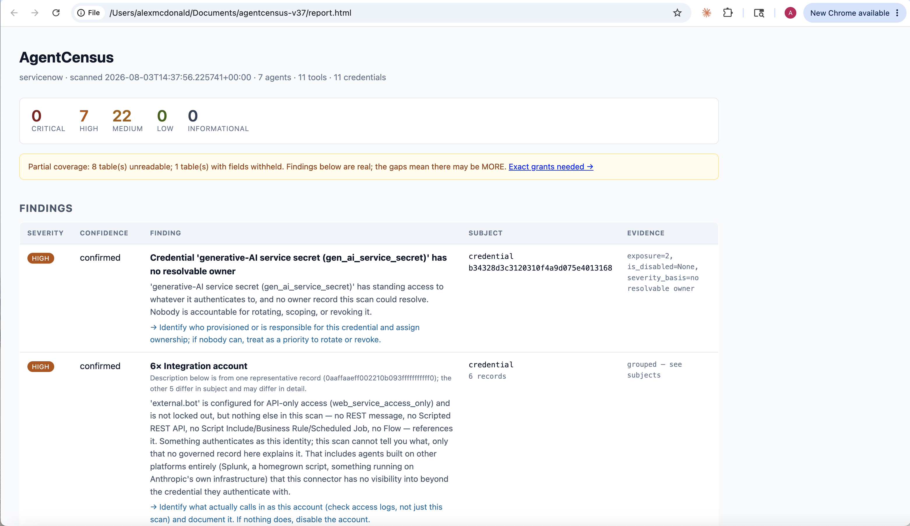

# AgentCensus

A read-only scanner that inventories the AI agents, tools, and credentials
already running on platforms you operate, maps how they depend on each
other, and flags what is ungoverned — before you try to govern any of it.

Currently supports **ServiceNow**. Runs from your machine against your own
instance; nothing is sent anywhere.

```
pip install -e .
agentcensus preflight --connector servicenow --include-script-scan
agentcensus scan --connector servicenow --include-script-scan --format both -o report.json
```

`--include-script-scan` is the recommended command, shown here first: without
it, the scan skips the tiers that read script source (Script Includes,
Business Rules, Scheduled Jobs, Scripted REST APIs), which is where
shadow-agent synthesis happens — leave it off and a real instance can come
back reporting 0 agents even when several exist. It requires a broader read
grant than the rest of the scan (see "Required access" below), which is why
it stays opt-in rather than the default — but run `preflight` with it first
so you know before you scan whether the grant is there.

> **Status: alpha (v0.1.0).** Verified against one live ServiceNow
> instance — see [Verified against](#verified-against) for
> exactly which detections have executed against real data and which have
> not. [COVERAGE.md](./COVERAGE.md) records the defects found during that
> testing, including one correction significant enough to warrant a
> retraction, in as much detail as the successes.

## Why this exists

Every vendor in the AI governance space sells a platform you adopt
going forward. Nobody sells the step that has to happen first: finding
out what already exists. You cannot govern an inventory you do not
have.



## Guarantees

- **Read-only, enforced in code.** The connector interface exposes
  only `fetch_*` methods. There is no write, update, or delete path —
  not a config flag, an architectural fact. See `core/connector.py`.
  The one exception worth naming explicitly: if you configure OAuth
  instead of Basic Auth, the client makes a single `POST` to exchange
  client credentials for a bearer token. That's an authentication
  handshake, not a write against anything the tool scans — see the
  docstring at the top of `connectors/servicenow/http.py` for why this
  doesn't weaken the read-only claim.
- **No egress.** No telemetry, no phone-home, no analytics. The scan
  runs against the platform you point it at and nothing else; output
  is written to a local file, mode 0600.
- **Script source is read, never published.** Tiers 3-4 have to read
  script bodies to detect anything, but no script body is written to a
  report. Each finding carries a sha256 fingerprint and length instead;
  `--include-script-excerpts` opts into a short, secret-scrubbed window
  around the match. This is not fastidiousness — the scripts this tool
  flags are by definition the ungoverned ones nobody reviewed, which
  makes them the likeliest place on the instance to hold a hardcoded
  API key. Publishing them into a report meant for auditors would aim a
  credential leak at precisely the highest-risk scripts just found.
  Enforced by `core/redaction.py` and `tests/test_redaction.py`, not by
  convention.
- **Least privilege, tiered.** The default scan only reads structured
  metadata (table contents, names, endpoints) — never admin. Reading
  raw script source (Script Includes, Business Rules, Scripted REST
  APIs) is a meaningfully more sensitive grant, so it's opt-in
  (`--include-script-scan`), not bundled into the default. See "Why the
  ServiceNow connector has three layers" below.
- **Deterministic.** Detection is rule-based, not model-based. Same
  input, same findings, every run. See `core/rules.py`.
- **Fault-isolated.** A single table your scan credential can't read
  degrades to a note in the report, not a crashed scan — see
  `connectors/servicenow/http.py`'s `safe_get_all`. Real instances have
  inconsistent ACLs across the tables this tool reads; it has to
  tolerate that to be usable on them.
- **It tells you what it could not see, and never calls that nothing.**
  Every refused read is recorded as data at the moment it happens and
  aggregated into a closing access section — the tables and fields to
  grant, and what each one unblinds. A tier that was blinded says it
  could not look, rather than reporting zero matches. Absence of a
  finding is a claim this tool makes only when it had the access to
  support it.

## Install

```
pip install -e .
```

(Not yet published to PyPI.)

## Quick start

Basic Auth:

```
export AGENTCENSUS_SN_INSTANCE="https://yourinstance.service-now.com"
export AGENTCENSUS_SN_USERNAME="a-read-only-account"
export AGENTCENSUS_SN_PASSWORD="..."

agentcensus scan --connector servicenow --include-script-scan --format html --output report.json
```

OAuth client credentials (for instances where Basic Auth is disabled by policy):

```
export AGENTCENSUS_SN_INSTANCE="https://yourinstance.service-now.com"
export AGENTCENSUS_SN_CLIENT_ID="..."
export AGENTCENSUS_SN_CLIENT_SECRET="..."

agentcensus scan --connector servicenow --include-script-scan --format html --output report.json
```

`--format html` renders a shareable report and opens it in your browser
when the scan finishes (pass `--no-open` to skip that). Drop
`--include-script-scan` only if the read grant below isn't available yet —
the scan still runs, just blind to script-derived detections.

### Required access — run `preflight` first

```
agentcensus preflight --connector servicenow --include-script-scan
```

Reads one row from each table it will scan, using the real field list,
and writes nothing. **Run this before the first scan**, because table
access alone is not enough.

ServiceNow applies FIELD-level ACLs on top of table-level ones, and when
one denies read it omits the field from the response with no error —
the row arrives with everything else intact. Combined with defensive
reads, a detection tier then reports "0 found", indistinguishably from
"none exist".

**A missing field has two possible causes, and they need opposite
responses.** ServiceNow omits a requested column that does not exist in
exactly the same way it omits one your account is denied: absent from the
row, HTTP 200, no error. So a scanner that assumes "denied" will send you
to your administrator to request access to a column that was never real.

AgentCensus consults `sys_dictionary` before deciding which it is looking
at. When the column exists, it reports a **FIELD-LEVEL ACL** and tells you
what to grant. When the column does not exist, it reports a **SCHEMA
MISMATCH — a defect in AgentCensus**, and explicitly asks you not to grant
anything for it.

This distinction exists because the tool got it wrong: eight column names
in this connector were incorrect, and the resulting silence was reported
to users as their permissions problem. `rest_endpoint` was one of them,
which meant that until it was corrected, the only CONFIRMED-grade outbound
detection in the product could not have matched anything on any instance.
All eight names are now corrected and verified against `sys_dictionary` on
a live instance; that detection runs. [COVERAGE.md](./COVERAGE.md) records
the episode in full.

On the reference instance, one genuine field-level ACL and five denied
tables remain:

| Table | Field | Tier blinded |
|---|---|---|
| `gen_ai_service_secret` | `name`, `purpose`, `state`, audit stamps | generative-AI credentials are detected but cannot be attributed |
| `sys_store_app` | *(table denied)* | installed spokes/apps vs. known providers |
| `auth_server_connection` | *(table denied)* | the MCP server registry itself |
| `auth_server_connection_tool_scan_result` | *(table denied)* | ServiceNow's own threat category and safety score for every tool an MCP server exposes — the highest-value grant on the list |
| `mcp_auth_scopes`, `aig_*` (3 tables) | *(tables denied)* | which MCP servers and tool groups this instance exposes |

<a id="verified-against"></a>

### Verified against

One ServiceNow PDI (Zurich-era, no Now Assist licence, IntegrationHub not
installed), scanned repeatedly through 2026-08. That is the entire body of
live evidence behind this connector, and it bounds what the guarantees
above are worth:

- **AI Agent Studio (`sn_aia_agent`) has never executed.** It is the
  primary native detection and is not available on any PDI — not in the
  Store, not in the plugin list, no schema at all. Its field list is
  inference validated by fixtures written from the same assumptions.
- **Outbound REST matching (tier 2) runs, but has only ever returned a
  negative.** Since the `rest_endpoint` correction it reads the endpoint
  column and evaluates it, and it correctly declined to match the four
  REST messages on the reference instance (two Firebase, Yahoo Finance, a
  mobile push). None of them point at an LLM, so the path from a host
  match through to a CONFIRMED-grade tool has been exercised only by
  fixtures, never by a real endpoint.
- **Flow Designer LLM-action matching has never fired**, because no
  third-party LLM spoke can be installed on that instance. The
  platform-native AI note (OneExtend / One API / ToolExecutor) has fired
  on real data; keyword matching against provider spokes has not.
- **The Anthropic and Splunk connectors have never run against anything
  real.**
- **Scale is untested.** Seven agents is not two hundred; report
  readability and precision at volume are unmeasured.

Findings are ranked, never suppressed, partly because that bound is real:
a tool this narrowly verified should not be quietly deciding what a
customer doesn't need to see.

Grant the scan account read on those fields, or treat those tiers'
results as unverified. `preflight` reports each one as `MISSING FIELDS`,
and a scan reports it as a `FIELD-LEVEL ACL` note — a blinded tier now
says it could not look rather than reporting zero matches.

**Every report ends with an "Access needed to complete this scan"
section**: one table listing each grant the scan account is missing and
what that grant buys back, deduplicated and field-level. The same data is
in the JSON as `access_gaps`, so a pipeline can gate on coverage. On the
instance above it lists twelve grants. You should not need to assemble
that list from the notes; that is what the section is for.

#### A dropped filter is worse than a denied read

ServiceNow **silently discards a query condition naming a field it can't
resolve** and returns the FULL UNFILTERED result set, with HTTP 200 and
no warning. Verified with a negative control: an impossible hostname
matched every row in the table.

An earlier version of this section attributed that to field-level ACLs.
The instance where it was measured had a wrong column name, so the honest
statement is narrower: **a condition on a field the query cannot resolve
— whether denied or nonexistent — is dropped, not rejected.** Either way
the caller receives everything while believing it received matches.

Every server-side filter in the connector therefore declares which fields
it depends on, and a scan that hits this reports `QUERY FILTER SILENTLY
DROPPED` and says the rows are not matches. Findings from such a read are
not merely incomplete; they may be wrong.

#### Admin is not a general answer

`admin` is a role that satisfies most ACLs, not a bypass. It still fails
against ACLs naming a different role (`admin_overrides=false`), against
`security_admin` (which needs session elevation the REST API has no step
for), and against **cross-scope application access**, where a scoped app
decides whether other scopes may read its tables at all. ServiceNow's own
AI Gateway tables fall in that last category, and no role grant fixes
them — they can be read in the UI or not at all.

So there is no single "scan role" that guarantees full coverage. The
access section reports the boundary rather than implying a role exists
that dissolves it.

Add `--format html` for a single self-contained, shareable report
(findings ranked by severity, coverage caveats up top) instead of raw
JSON, or `--format both`. Add `--fail-on high` to exit non-zero when a
scan surfaces something at or above a given severity, for scheduled/CI
use.

Add `--include-script-scan` to also read script source for the deeper
(and more sensitive) shadow-detection tiers. Add `--llm-providers-extra
path/to/extra.yaml` to add your own internal/self-hosted LLM gateway
hostnames on top of the bundled list — see
`connectors/servicenow/llm_providers.yaml`.

Anthropic (Admin API key — organization members, API keys; add an
`org:admin` OAuth token to also include WIF service accounts):

```
export AGENTCENSUS_ANTHROPIC_ADMIN_KEY="sk-ant-admin..."
# optional, for service accounts:
export AGENTCENSUS_ANTHROPIC_OAUTH_TOKEN="..."

agentcensus scan --connector anthropic --output report.json
```

Splunk (static auth token or username/password against the management
port, default 8089):

```
export AGENTCENSUS_SPLUNK_URL="https://splunk.example.com:8089"
export AGENTCENSUS_SPLUNK_TOKEN="..."

agentcensus scan --connector splunk --output report.json
```

## What it detects

Grouped by finding class — see `src/agentcensus/rules/` for the
current rule set and the project plan for the full target list:

- **Orphaned and abandoned** — agents whose creator has left or gone
  inactive, agents with no resolvable owner at all, agents with no
  recent activity, credentials (API keys, integration accounts, HEC
  tokens) with no resolvable owner regardless of which connector found
  them.
- **Access and permission risk** — agents running under shared/human
  accounts instead of scoped service accounts, irreversible actions
  with no human approval gate and credentials with no audit logging
  (both **not yet reachable** — no shipped connector populates
  `is_irreversible` or `has_audit_logging`; the rules exist and are
  tested, but cannot fire against any current connector),
  agents with standing write access to a table the environment has
  configured as sensitive (`--sensitive-table`, see below).
- **Construction quality** — missing descriptions. (Undefined
  failure/fallback behaviour is modelled but **not yet reachable**: no
  shipped connector populates `has_defined_fallback`.)
- **Redundancy and waste** — agents with zero successful outcomes,
  duplicate agent names.
- **Ungoverned integration** — agents, tools, and credentials
  AgentCensus inferred from platform artifacts (outbound calls to known
  LLM APIs, OAuth entities, scripted API surfaces) rather than read from
  any native governance table, plus the provider-agnostic case: an
  active, API-only account nothing else in the scan can explain (no
  tool references it, nothing governs it) — the closest a single-platform
  connector can get to seeing an agent that lives entirely on another
  platform, including one this project has no connector for at all. See
  "Why the ServiceNow connector has three layers" below.
- **Dependency mapping** — the differentiating capability. Everyone
  else produces a list; this produces a graph (`core/graph.py`), so a
  single orphaned credential surfaces every agent downstream of it.

## Connectors

| Platform | Status |
|---|---|
| ServiceNow | Implemented, verified against three independent live PDIs, including a real user-run test against an independently-built custom agent — see COVERAGE.md's live-verification sections. Found and fixed two real pagination bugs there; the custom agent (`ClaudeAgentService`) is now correctly detected end-to-end at the expected confidence level |
| Anthropic (Admin API) | Implemented, not yet run against live credentials — see `connectors/anthropic/http.py` |
| Splunk | Implemented, not yet run against a live instance — see `connectors/splunk/connector.py` |
| Microsoft 365 / Copilot Studio | Not yet implemented |

The core is platform-agnostic by design (`core/connector.py`). Adding
a platform means implementing one interface and returning the same
normalized models everything else already understands — see
CONTRIBUTING.md.

Run more than one connector in a single scan for a cross-platform view
— `--connector` is repeatable:

```
agentcensus scan --connector servicenow --connector splunk --output report.json
```

Findings run against one merged inventory, and the report's dependency
graph links agents/credentials that correlate across platforms (shared
OAuth client, shared owner email — never guessed from name similarity)
into one connected graph instead of two disjoint ones. See
`core/correlate.py`.

**See [COVERAGE.md](./COVERAGE.md) for the full scenario coverage
matrix** — out-of-box agents/tools/MCP servers, custom
agents/tools/skills/flows, external integrations on any platform, and
what's architecturally undetectable by any scanner (not a gap, a stated
limit).

### Why the ServiceNow connector has three layers

Verified directly against a live ServiceNow PDI: there is no single
native "AI agent" table. Enterprise AI Agent Studio (`sn_aia_*`)
requires paid Now Assist licensing and doesn't exist on a free
instance at all; a separate, architecturally different trial app
(`sn_build_agent_*`) may exist instead. `native.py` detects which, if
either, is present rather than assuming one.

Neither native schema catches an agent someone hand-built directly on
the platform — Script Include + Scripted REST API + Business Rule
calling out to an LLM is an ordinary way to build this, not a corner
case, and it leaves no row in any "AI agent" table ServiceNow itself
knows about. `shadow.py` finds these by tiered signal strength:

1. OAuth entities whose name/client_id matches a known LLM provider —
   heuristic (text match on an opaque identifier, not a verified URL
   field yet), needs review.
2. Outbound REST message definitions (including per-method endpoint
   overrides) whose endpoint matches a known LLM API host
   (`connectors/servicenow/llm_providers.yaml`, editable) — structural,
   confirmed.
3. Scripted REST API resources that look like they expose a tool/MCP
   surface *outward* — heuristic, needs review. **Opt-in** — reads
   script source, see `--include-script-scan` above.
4. Keyword matches in script source across every table that can hold
   one — Script Include, Business Rule, Scheduled Job, Service Portal
   widget (where a chat UI lives), UI Action ("Summarize with AI"
   buttons), inbound email action (an agent you email), fix script,
   processor, and Scripted REST API resource. A script that calls an already-confirmed tier-2 REST message
   gets an Agent built for it at CONFIRMED confidence, correlated to
   that tool; a script that only matches an LLM keyword with no
   corresponding REST message record gets a NEEDS_REVIEW Agent plus a
   synthesized placeholder Tool, specifically so it isn't a disconnected
   node in the dependency graph — an earlier version of this dropped
   that correlation on both ends and it was a real bug, not a style
   choice. **Opt-in**, same reason as tier 3.

Neither layer above catches the *no-code* path, which is arguably the
more common one — the project's own thesis is about non-technical
employees building agents in minutes, and that's Flow Designer, not a
hand-written Script Include. `flow_designer.py` covers this, default-on
(it reads flow/action names and installed-app metadata, not script
source, so it doesn't need the higher-privilege gate):

- Installed IntegrationHub spokes/apps matching a known LLM provider —
  needs review, doesn't mean a flow is actively using it.
- Flows (`sys_hub_flow`) whose name/description matches a provider
  keyword — needs review.
- Action steps (`sys_hub_action_instance`) whose name matches a
  provider keyword, correlated back to their parent flow the same way
  shadow.py's tier 4 correlates scripts to REST messages — the flow
  becomes the Agent, the action becomes a Tool the Agent's `tool_ids`
  point to. **Known limitation:** only looks at names/descriptions, not
  the JSON-blob action input values where a configured endpoint would
  actually live if nothing in the flow or step name gives it away —
  closing that gap needs the input-value table/field shape verified
  against a live instance, not yet done.

A fifth layer, `config_surfaces.py`, is default-on and needs no script
access: LLM endpoints configured in **system properties** or **Connection
& Credential Aliases** rather than hardcoded. This closes an inversion
where a *well-engineered* integration — endpoint in `gs.getProperty()`
instead of inline — was less visible than a sloppy one, since the script
then contains no provider hostname or keyword for tiers 2/4 to match.
Property values are matched against the same host list tier 2 uses, so
these are CONFIRMED-grade structural signals. Properties typed as
password/encrypted are skipped without their values ever being read.

`domain_scope.py` checks whether the instance is domain-separated and
says so in the report. ServiceNow filters every read by the scan
account's domain silently and without error, so a scan from a child
domain returns a clean, complete-looking report covering one tenant.
AgentCensus reports the limit rather than escalating privilege past it.

Every finding carries a `confidence` (`confirmed` or `needs_review`).
`needs_review` findings are capped at MEDIUM severity regardless of
what they'd otherwise score — a keyword hit is a lead, not a verdict.
See the provenance/confidence design note at the top of `core/models.py`.

### What's explicitly out of scope for v1

Named here on purpose rather than left as a silent gap:

- **Virtual Agent / Now Assist chatbot topics** (`sys_cs_topic` and
  related) — an older, distinct ServiceNow conversational AI surface
  from AI Agent Studio/Build Agent, still common in production. Not
  scanned.
- **Predictive Intelligence / ML models** (`ml_*` tables) — arguably a
  different category (classification/prediction, not agentic action),
  excluded rather than silently missed.
- **MID Server-routed outbound calls** — an LLM call routed through a
  MID Server for on-prem-to-cloud connectivity has connection details
  in different tables (`ecc_agent` and related) than a direct outbound
  REST message. Not covered.
- **Embedded generative AI features** in core products (e.g. case/
  incident summarization) backed by `sys_gen_ai_log_metadata` and
  similar — these are product features, not autonomous agents, and
  scope discipline here is deliberate (see the project plan's "what
  this is not").

## What this is not

Not a governance platform. Not a remediation tool. Not a monitoring
service. It finds and maps what exists; what you do about it is yours.

## License

Apache 2.0. See [LICENSE](./LICENSE). Contributions use a DCO, not a
CLA — see [CONTRIBUTING.md](./CONTRIBUTING.md).
